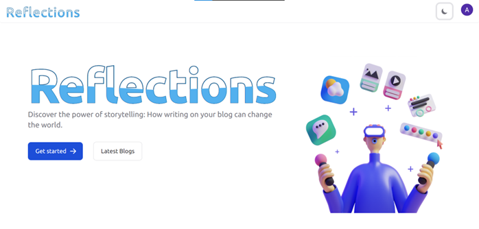
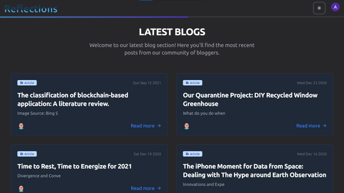
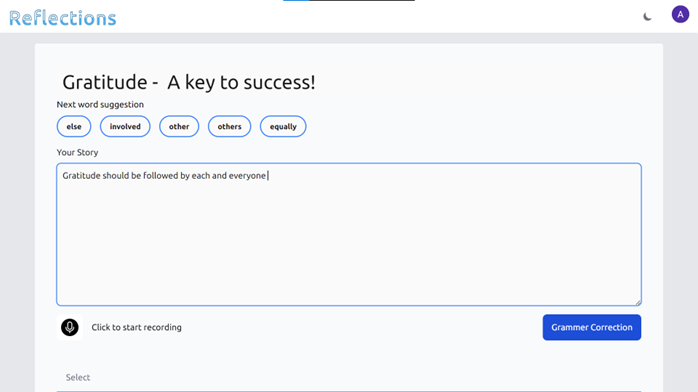
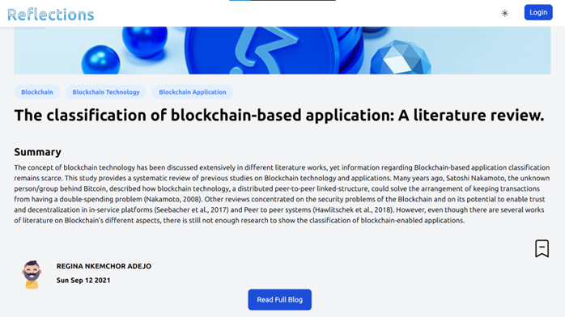
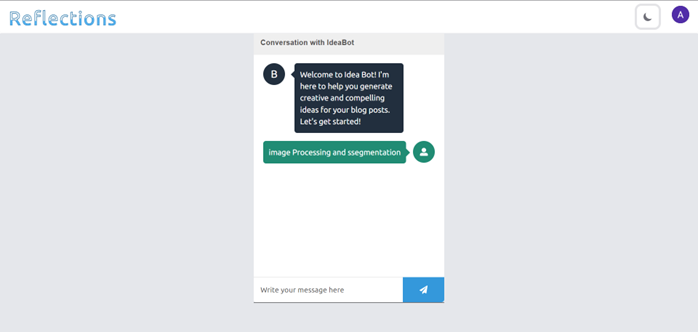

# Deliverables

- A blog web application where people can post articles about any topic. The features are as follows:
- The website recommend articles and shows related searches.
- It summarizes the articles in a way in which most of the important points of the article are covered.
- It allow readers to write comments and classify them into positive or negative sentiments.
- Word suggestions, Grammar Correction are also implemented.
- Speech to Text and Text to Speech implemented as well.

# HomePage

# Latest Blogs

# Next Word Prediction

# Summarization

# IdeaBot

